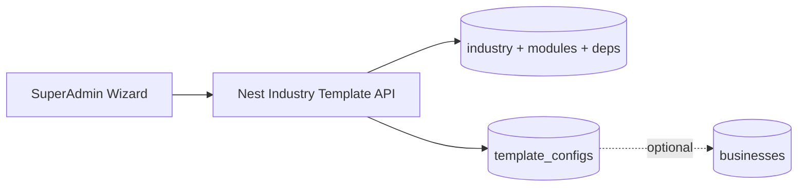

# Industry Template Backend + Database Schema

## Context

This app ([drm-admin](src/app/dashboard/superAdmin/industry-templates/page.tsx)) is frontend-only today. The wizard (Select → Customize → Generate) builds a [`CustomizedTemplateConfig`](src/templates/types.ts) and saves it via [`localStorage`](src/template-engine/storage.ts). Catalog data lives in TS: [`INDUSTRY_TEMPLATES`](src/templates/industries.ts), [`MODULE_CATALOG`](src/templates/modules.ts), [`INDUSTRY_MODULE_PLANS`](src/templates/module-dependencies.ts).

Persistence belongs on the existing external Nest API (`BASE_URL` / `vendor.umazing.shop`), same pattern as [`/business`](src/hooks/useBusiness.ts) and [`/plan`](src/hooks/usePlan.ts). This plan covers **DB schema + API contracts** for that backend.



## Design decisions (locked)

1. **Two layers:** seedable **industry catalog** (blueprints) + **saved configs** (what Generate persists).
2. **Hybrid storage:** normalized tables for catalog/deps; **JSONB** on configs for `labels`, `navigation`, `enabled_modules`, `dashboard_cards` so API responses match the UI type 1:1.
3. **`business_id` nullable** on configs — UI today only collects `businessName`; linking to a real business is a later apply/provision step.
4. **Logo:** store `logo_url` (uploaded file URL), not base64 `logoDataUrl`.
5. **Server validates** module enable/disable against the same dependency graph as [`module-dependencies.ts`](src/templates/module-dependencies.ts).
6. **Auth:** Bearer token; endpoints restricted to super-admin (same gate as other super-admin CRUD).

---

## 1. Database schema (PostgreSQL)

### Catalog (seed from current TS constants)

**`modules`**
| Column | Type | Notes |
|--------|------|--------|
| `id` | `varchar` PK | `ModuleId` e.g. `pos`, `kitchen` |
| `label` | `varchar` | |
| `description` | `text` | |
| `category` | `varchar` | from `MODULE_CATALOG` |
| `sort_order` | `int` | optional |

**`dashboard_cards`**
| Column | Type | Notes |
|--------|------|--------|
| `id` | `varchar` PK | `DashboardCardId` |
| `label` | `varchar` | |
| `description` | `text` | |

**`industry_templates`** (15 blueprints)
| Column | Type | Notes |
|--------|------|--------|
| `id` | `varchar` PK | e.g. `pharmacy`, `restaurant` |
| `name` | `varchar` | |
| `description` | `text` | |
| `family` | `varchar` | `IndustryFamily` enum |
| `accent` | `varchar` | `AccentColor` |
| `icon` | `varchar` | icon key for `IndustryIcon` |
| `labels` | `jsonb` | `{ product, products, customer?, ... }` |
| `roles` | `jsonb` | `string[]` |
| `workflows` | `jsonb` | `string[]` |
| `special_screens` | `jsonb` | `string[]` |
| `features` | `jsonb` | `{ batchTracking?, kitchen?, ... }` |
| `is_active` | `boolean` | default true |
| `created_at` / `updated_at` | `timestamptz` | |

**`industry_default_modules`**
| Column | Type |
|--------|------|
| `industry_id` | FK → `industry_templates` |
| `module_id` | FK → `modules` |
| `is_default` | `boolean` | true = `modules[]`, false = `optionalModules[]` |
| `sort_order` | `int` |
| PK `(industry_id, module_id)` |

**`industry_default_dashboard_cards`**
| Column | Type |
|--------|------|
| `industry_id` | FK |
| `card_id` | FK → `dashboard_cards` |
| `sort_order` | `int` |
| PK `(industry_id, card_id)` |

**`industry_module_plans`**
| Column | Type |
|--------|------|
| `industry_id` | FK PK |
| `summary` | `text` | |
| Compulsory shell always `dashboard` + `settings` (can also be rows with `is_compulsory`) |

**`industry_module_dependencies`**
| Column | Type | Notes |
|--------|------|--------|
| `industry_id` | FK | |
| `module_id` | FK | module that requires others |
| `depends_on_module_id` | FK | |
| PK `(industry_id, module_id, depends_on_module_id)` |

Maps `dependencies: { pos: ["products"], ... }` from the UI.

### Saved configs (wizard Generate output)

**`template_configs`** ≈ [`CustomizedTemplateConfig`](src/templates/types.ts)

| Column | Type | UI field |
|--------|------|----------|
| `id` | `uuid` PK | replace client `tpl_…` |
| `business_id` | `uuid` NULL FK → `businesses` | future link |
| `business_name` | `varchar` | required |
| `industry_id` | `varchar` FK → `industry_templates` | |
| `industry_name` | `varchar` | denormalized |
| `family` | `varchar` | |
| `currency` | `varchar(8)` | PKR/USD/AED/EUR |
| `location` | `varchar` | |
| `branch_count` | `int` | default 1 |
| `logo_url` | `text` NULL | |
| `primary_color` | `varchar(16)` | hex |
| `secondary_color` | `varchar(16)` | hex |
| `theme_mode` | `varchar(8)` | `light` \| `dark` |
| `labels` | `jsonb` | product wording |
| `enabled_modules` | `jsonb` | `ModuleId[]` |
| `navigation` | `jsonb` | `[{ moduleId, label, visible }]` ordered |
| `dashboard_cards` | `jsonb` | `DashboardCardId[]` |
| `created_by` | `uuid` NULL | super-admin user |
| `created_at` / `updated_at` | `timestamptz` | |

Indexes: `(industry_id)`, `(business_id)`, `(created_at DESC)`.

### Business linkage (minimal)

Add nullable columns on existing `businesses` (or equivalent):

- `industry_id` → `industry_templates.id`
- `template_config_id` → `template_configs.id`

Used when provisioning a business from a saved template (not required for wizard v1 save/list/delete/preview).

---

## 2. API contracts (Nest, match `/business` + `/plan` style)

Base path: **`/industry-template`** (singular, consistent with `/plan`).

### Catalog (wizard Step 1 + customize defaults)

| Method | Path | Purpose |
|--------|------|---------|
| `GET` | `/industry-template/industries` | List active blueprints (shape of `IndustryTemplate[]`) |
| `GET` | `/industry-template/industries/:id` | One blueprint + default modules/cards |
| `GET` | `/industry-template/industries/:id/module-plan` | `{ compulsory, dependencies, summary }` |
| `GET` | `/industry-template/modules` | Full `MODULE_CATALOG` |
| `GET` | `/industry-template/dashboard-cards` | Full card catalog |

Response for an industry should assemble the same shape the UI already uses so the FE can drop `INDUSTRY_TEMPLATES` later:

```ts
{
  id, name, description, family,
  theme: { accent, icon },
  labels, modules, optionalModules, dashboardCards,
  roles, workflows, specialScreens, features
}
```

### Saved configs (wizard Generate + saved list + preview)

| Method | Path | Purpose |
|--------|------|---------|
| `GET` | `/industry-template` | List saved configs (newest first) |
| `GET` | `/industry-template/:id` | Preview load |
| `POST` | `/industry-template` | Create from Generate |
| `PATCH` | `/industry-template/:id` | Update (future edit flow) |
| `DELETE` | `/industry-template/:id` | Remove from saved list |

**`POST` body** (mirrors `createCustomizedConfig` input + resolved arrays):

```ts
{
  businessName: string;          // required
  industryId: string;            // required
  currency?: string;
  location?: string;
  branchCount?: number;
  logoUrl?: string;
  primaryColor: string;
  secondaryColor: string;
  themeMode: "light" | "dark";
  enabledModules: string[];
  navigation: { moduleId: string; label: string; visible: boolean }[];
  dashboardCards: string[];
  labels: { product: string; products: string; customer?: string; ... };
  businessId?: string;           // optional link
}
```

**Response:** full `CustomizedTemplateConfig` with server `id`, `createdAt`, `industryName`, `family` filled from catalog.

### Apply to business (phase 2, after wizard CRUD works)

| Method | Path | Purpose |
|--------|------|---------|
| `POST` | `/industry-template/:id/apply` | Body `{ businessId }` — set business industry/template + enable modules for that tenant |

Keep this out of MVP if the UI only needs save/list/preview/delete.

---

## 3. Server validation rules (from UI)

On `POST`/`PATCH`:

1. `businessName` non-empty; `industryId` must exist and be active.
2. `themeMode` ∈ `light|dark`; colors valid hex; `currency` ∈ allowed set; `branchCount` ≥ 1.
3. Every `enabledModules` / `navigation.moduleId` / `dashboardCards` id must exist in catalog.
4. **Dependency cascade:** using `industry_module_dependencies` for that industry:
   - Reject (or auto-expand) if a module is enabled without its dependencies.
   - Reject if a compulsory module (`dashboard`, `settings`) is missing.
5. `navigation` order is authoritative; entries for disabled modules may exist with `visible: false` or be filtered — prefer storing full ordered list as UI does today.
6. Prefer **server auto-expand** of dependencies on create (same as `withDependenciesEnabled`) so FE and BE stay aligned; return the normalized config.

---

## 4. Seed migration

One-time seed from current frontend constants:

- 15 rows → `industry_templates` + join tables ([`industries.ts`](src/templates/industries.ts))
- All modules + cards → catalogs ([`modules.ts`](src/templates/modules.ts))
- Per-industry deps → `industry_module_dependencies` ([`module-dependencies.ts`](src/templates/module-dependencies.ts))

Keep TS catalogs in the FE as fallback until catalog endpoints are wired; seed is the source of truth on the backend.

---

## 5. Implementation order (backend)

1. Migrations for catalog tables + `template_configs` + seed script.
2. Catalog read endpoints (industries, module-plan, modules, cards).
3. Config CRUD with validation/normalization.
4. Optional: logo upload endpoint (or reuse existing file upload) → `logo_url`.
5. Phase 2: `businesses.industry_id` / `template_config_id` + `apply` endpoint.
6. FE follow-up (separate from this backend plan): RTK Query hook like `usePlan`, swap [`storage.ts`](src/template-engine/storage.ts) calls in the wizard/preview pages.

---

## 6. Mapping UI steps → API

| UI step | Backend |
|---------|---------|
| Select Industry | `GET .../industries` (+ list saved via `GET /industry-template`) |
| Customize (modules/deps/cards/theme) | `GET .../industries/:id` + `.../module-plan`; client still runs live preview |
| Generate | `POST /industry-template` |
| Saved list preview/delete | `GET /:id`, `DELETE /:id` |
| Preview page `?id=` | `GET /industry-template/:id` |

No Next.js DB or API routes in this repo except optional CORS proxy later if needed (same pattern as public-catalog).
